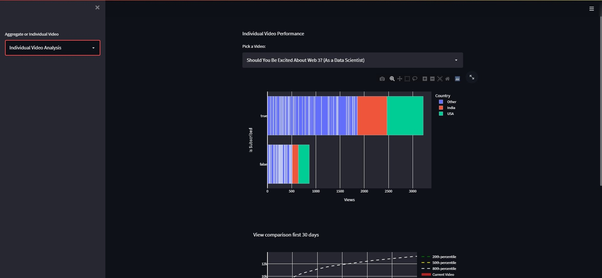

# YT-Dashboard---Ken-Jee
## A simple dashboard on youtuber Ken Jee's channel

This project is built using Python and Streamlit. 

All the requirements for running this project can be seen in the 'requirements.txt' file in the repository.

## The project consists of 2 main pages
1. The Aggregate Metrics
 - 
 - 

2. Individual Video Analysis 
 - 
 - 

